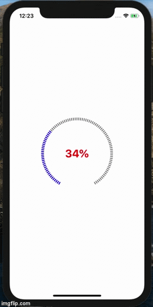

# UIProgressRing for iOS

[](https://github.com/shahbazsaleem01/UIProgressRing#mit-license)


UIProgressRing is an easy way to display a progress in a ring shape and its completely customisable. If you find any limation, you can always request.

Preview
-


Example
-
```swift
import UIKit
import UIProgressRing

class ViewController: UIViewController {

    @IBOutlet weak var progressRing: UIProgressRingView!
    
    override func viewDidAppear(_ animated: Bool) {
        super.viewDidAppear(animated)
        
        progressRing.setProgress(progress: 50)
        progressRing.setBackgroundConfig(config: RingShapeLayer.Config(startAngle: 91, endAngle: 90, lineWidth: 10, color: .black, strokeEnd: 1.0, lineDashPattern: [2.5,2.5]))
        progressRing.setForeGroundConfig(config: RingShapeLayer.Config(color: .red))
        
        progressRing.progressLabelFont = UIFont.systemFont(ofSize: 30, weight: .bold)
        progressRing.progressLabelColor = .red
        
        Timer.scheduledTimer(withTimeInterval: 5, repeats: true) { (timer) in
            self.progressRing.setProgress(progress: Double.random(in: 10...100))
        }   
    }
}
```
Installation
-
You can add UIProgressRing using Swift Package Manager or Manually download and add UIProgressRing.swift in your project.

MIT License
-----------

Copyright (c) 2020 Shahbaz Saleem

Permission is hereby granted, free of charge, to any person obtaining a copy of this software and associated documentation files (the "Software"), to deal in the Software without restriction, including without limitation the rights to use, copy, modify, merge, publish, distribute, sublicense, and/or sell copies of the Software, and to permit persons to whom the Software is furnished to do so, subject to the following conditions:

The above copyright notice and this permission notice shall be included in all copies or substantial portions of the Software.

THE SOFTWARE IS PROVIDED "AS IS", WITHOUT WARRANTY OF ANY KIND, EXPRESS OR IMPLIED, INCLUDING BUT NOT LIMITED TO THE WARRANTIES OF MERCHANTABILITY, FITNESS FOR A PARTICULAR PURPOSE AND NONINFRINGEMENT. IN NO EVENT SHALL THE AUTHORS OR COPYRIGHT HOLDERS BE LIABLE FOR ANY CLAIM, DAMAGES OR OTHER LIABILITY, WHETHER IN AN ACTION OF CONTRACT, TORT OR OTHERWISE, ARISING FROM, OUT OF OR IN CONNECTION WITH THE SOFTWARE OR THE USE OR OTHER DEALINGS IN THE SOFTWARE.
